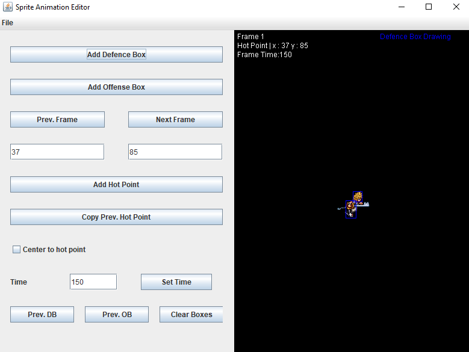
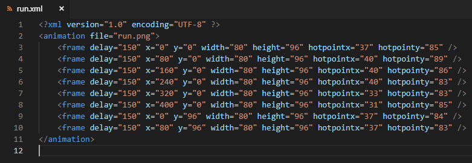

# SpriteAnimationEditor
It is a tool to create sprite animations for some of my 2D games. The convertion to XML and the spritesheet generation is done by another tool that I wrote. You can find it also on my Github.

## Screenshots

**Example of animation folder**

**Spritesheet when converted to XML**

**XML file of the animation**

